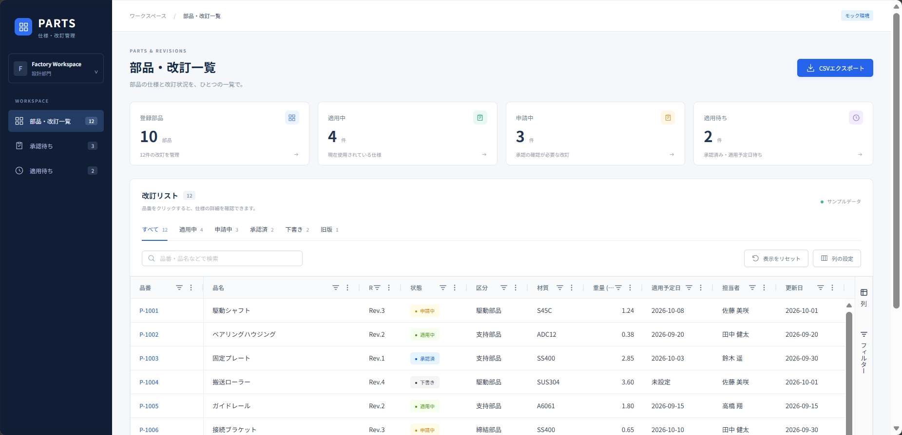

# 🚧 React・C#・Oracle 学習用アプリ

AG Grid・C#・Oracleを使い、図書館の蔵書・貸出管理を題材にした業務アプリを作成しています。実物の本がある前提で、蔵書検索・貸出・返却を扱う方針です。

現在は、旧題材である部品・改訂管理のモック画面、ASP.NET Core Web API、Oracle Database Freeの開発環境を用意しています。`/weather`には、Orvalで生成したクライアントから既存APIへ接続する天気予報サンプルがあります。図書館向けの画面・業務処理、Oracleとの連携は今後実装予定です。

予約、購入希望の申請・承認、延滞確認のバッチは追加候補です。学習方針と未確定事項は[PROJECT_CONTEXT.md](docs/PROJECT_CONTEXT.md)にまとめています。

業務の流れと設計候補は、[イベントストーミング](docs/modeling/event-storming.md)と[ドメインモデル](docs/modeling/domain-model.md)にまとめています。

以下は旧題材の仮画面です。



## 前提条件

- Node.js：24以上
- pnpm
- .NET 10 SDK（APIの起動・バックエンドのテスト実行に必要）
- Docker CLI・Docker Composeが利用できる環境
  - 現在はWindows 11のRancher Desktopで、コンテナエンジンに`dockerd (moby)`を使用しています。
  - Oracleを起動する前にRancher Desktopを起動してください。

## 起動手順

### フロントエンド

リポジトリのルートから実行します。

```powershell
cd apps/frontend
pnpm install --frozen-lockfile
pnpm dev
```

ターミナルに表示されるURLをブラウザで開きます。通常は`http://localhost:5173`です。

### バックエンド

リポジトリのルートで実行します。

```powershell
dotnet run --project apps/backend/FactoryTraining/FactoryTraining.Api --launch-profile http
```

APIは`http://localhost:5199`で起動します。フロントと同時に起動し、`/weather`を開くと天気予報サンプルを確認できます。
OpenAPI定義は開発環境の`http://localhost:5199/openapi/v1.json`で取得できます。
クライアントの生成手順は[フロントのREADME](apps/frontend/README.md)を参照してください。

APIは`net10.0`／C# 7.3でビルドします。C# 7.3と互換性のないコードを生成するOpenAPIのXMLコメント用Source Generatorだけを除外しています。
実行時のOpenAPI定義出力は有効です。設定の根拠は[Microsoft公式の無効化手順](https://learn.microsoft.com/en-us/aspnet/core/fundamentals/openapi/openapi-comments?view=aspnetcore-10.0#disabling-xml-documentation-support)を参照してください。

HTTP専用プロファイルでは、HTTPS転送先が未設定という警告が出る場合があります。この起動方法でローカルのHTTP API接続を確認しています。

### データベース

※部品・改訂画面はモックデータ、天気予報画面はDBを使わないAPIで動作するため、どちらもOracleの起動は不要です。

リポジトリのルートで実行します。

```powershell
docker compose up -d
```

Windows上のDBクライアントから接続する場合の設定です。

| 項目             | 値          |
| ---------------- | ----------- |
| ホスト           | `localhost` |
| ポート           | `1521`      |
| サービス名       | `FREEPDB1`  |
| 管理用ユーザー   | `PDBADMIN`  |
| 開発用パスワード | `Password1` |

`FREEPDB1`は、Oracle Freeイメージが用意するPDBの名前です。アプリ専用のDBユーザーは今後作成予定です。

DBを停止するときは、リポジトリのルートで実行します。

```powershell
docker compose down
```

## バックエンドのテスト

`FactoryTraining.Api.Tests` に、xUnitを使ったWeatherForecast APIのテストがあります。
`WebApplicationFactory` がテスト内でAPIを起動するため、APIやOracleを事前に起動する必要はありません。

### .NET CLI

リポジトリのルートで実行します。

```powershell
dotnet test apps/backend/FactoryTraining/FactoryTraining.Api.Tests/FactoryTraining.Api.Tests.csproj
```

### Visual Studio

1. `apps/backend/FactoryTraining/FactoryTraining.slnx` を開きます。.NET 10に対応したVisual Studioが必要です。
2. ソリューションをビルドし、［テスト］→［テスト エクスプローラー］を開きます。
3. 対象テストを右クリックして［実行］を選びます。［デバッグ］を選ぶと、テストやControllerのブレークポイントで停止できます。

## 構成

| パス             | 内容                                                 |
| ---------------- | ---------------------------------------------------- |
| `apps/frontend/` | Vite・React・TypeScript・Ant Design・AG Gridの仮画面 |
| `apps/backend/`  | ASP.NET Core Web APIの雛形                           |
| `compose.yaml`   | Oracle Database Freeの開発環境                       |
