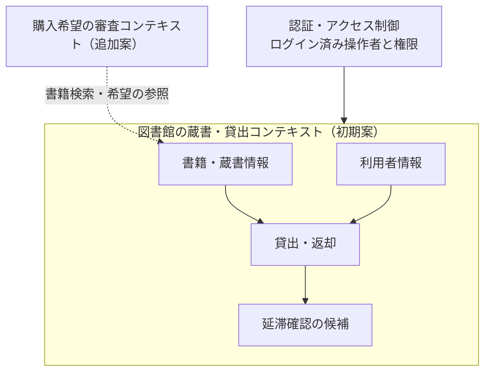
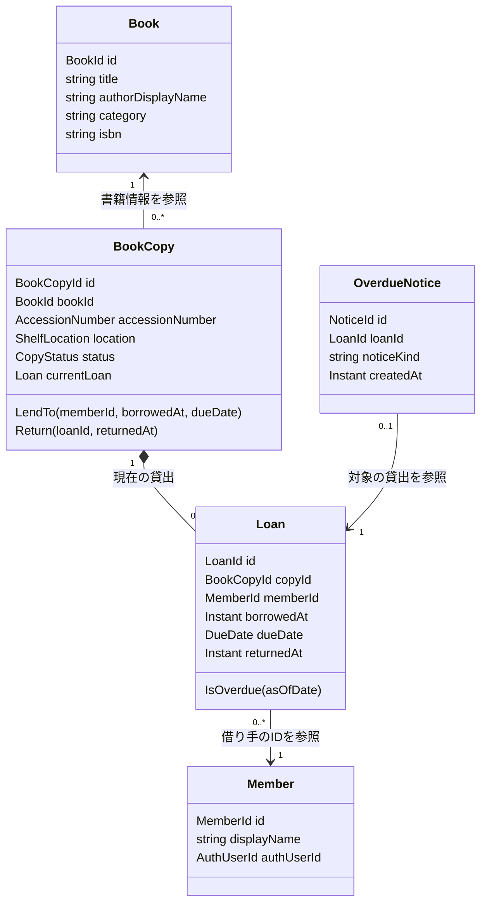
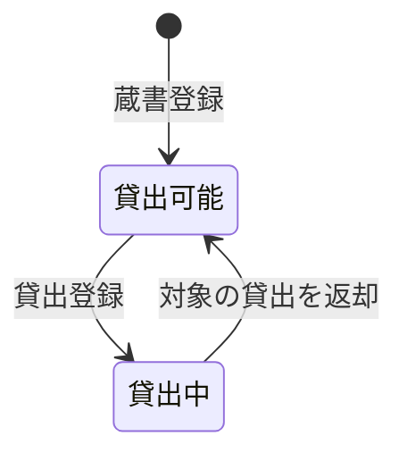
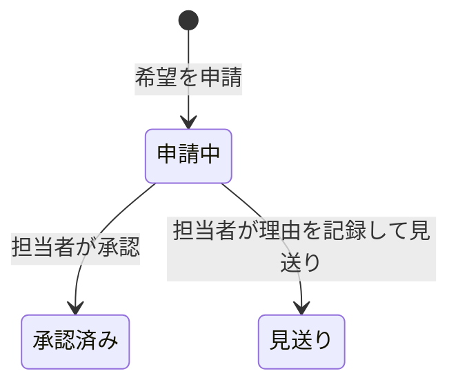

# 図書館システムのドメインモデル

作成日：2026-10-01

状態：[イベントストーミング](event-storming.md)から整理した、学習用の設計候補。コード・DBは未実装。

## 1. モデルで解決すること

担当者が実物の本を貸し出し、返却を受け取る。その際に、誰へどの一冊をいつまで貸しているかを記録し、同じ一冊を二人へ同時に貸さない。

[参考記事](https://zenn.dev/yamachan0625/books/ddd-hands-on/viewer/chapter4_domain_modeling)の観点を使い、用語、識別、関係、ルール、業務境界を整理した。以下は今回の図書館の案であり、実在する図書館の標準仕様ではない。仮定A-01〜A-06と未解決事項H-01〜H-07は[イベントストーミング資料](event-storming.md)を参照する。

## 2. 共通の用語

| 用語 | このモデルでの意味 | 名前の候補 |
|---|---|---|
| 書籍 | 同じ版のタイトル・著者などをまとめた書籍情報。実物そのものとは別 | Book |
| 蔵書 | 図書館が所蔵する実物の一冊 | BookCopy |
| 蔵書番号 | 一冊を識別する、図書館内で重複しない番号 | AccessionNumber |
| 貸出 | 一冊を一人へ貸した一回の記録 | Loan |
| 現在の貸出 | その一冊の、まだ返却されていない貸出 | CurrentLoan |
| 返却期限 | 返却が必要な日付。A-03では当日の返却を認める | DueDate |
| 延滞 | 未返却で、基準日が返却期限より後になっていること | IsOverdue |
| 利用者 | 本を借りる人。ログイン情報とは役割を区別する | Member |
| 担当者 | 貸出・返却・蔵書登録を操作する図書館側の人 | Librarian |
| 延滞通知候補 | 延滞の確認用に作る記録。送信済みを意味しない | OverdueNotice |
| 購入希望 | 利用者が提出し、担当者が採否を判断する希望 | PurchaseRequest |

例：「学習用サンプル本A」の書籍情報が一つあり、蔵書C-001とC-002がある。C-001の貸出L-101が返却された後、別の利用者へ貸すと新しい貸出L-102になる。

BookId、BookCopyId、LoanIdはそれぞれ別の識別子。ISBNは書籍情報の属性候補であり、一冊や貸出の識別子にはしない。

## 3. 業務の分け方

| 領域 | 今回の位置づけ | 責任 |
|---|---|---|
| 貸出・返却 | 学習アプリの中心 | 一冊の貸出可否、現在の貸出、期限、返却 |
| 書籍・蔵書情報 | 中心の業務を支える領域 | タイトル・著者、各冊の識別と保管場所 |
| 利用者情報 | 支援領域 | 借り手の識別と、採用した利用条件 |
| 認証・アクセス制御 | 汎用的な関心事 | ログインと操作者の権限確認 |
| 延滞確認 | 貸出の業務を支える処理候補 | 期限判定と通知候補の重複防止 |
| 購入希望の審査 | 追加候補 | 希望の提出、承認・見送り、判断理由 |

「中心」はこの学習アプリで重視する範囲を表す。実際の図書館の競争優位や経営上のコアドメインを評価した結果ではない。

初期案では、蔵書・利用者・貸出を同じ業務境界に置く。小さなアプリなので、書籍情報と貸出を最初から別サービスに分割しない。認証の仕組みと業務上の利用者情報は区別し、認証側の識別子を対応づける。



この境界は用語とルールの責任を分ける案。配置は一つのWeb APIと一つのOracleでよく、サービス間通信やマイクロサービス化は前提にしない。承認した購入希望から蔵書を自動生成する接続も置かない。

## 4. モデルと関係

次の図は業務概念の関係。DBのER図やC#の実装済みクラス図ではない。



一冊には過去の貸出が複数あるが、変更操作で読み込む「現在の貸出」は0か1件。図の0..1はこの範囲を表す。返却済みの記録は保持し、履歴一覧で検索する。過去の全件をBookCopyのオブジェクトへ毎回読み込む案にはしない。

表記上のInstantは時刻、DueDateは業務上の日付を意味する。採用する.NET型、nullの表現、Oracle型は実装時に決める。authorDisplayNameは初期案の表示文字列で、著者管理や複数著者の正規化を確定したものではない。

## 5. ルールを守る単位：集約の候補

| 候補 | 中に置くもの | 守るルール | この大きさにした理由 |
|---|---|---|---|
| Book | 書籍情報 | 書籍情報の入力条件 | タイトルの修正と貸出操作の責任を分ける |
| BookCopy | 一冊の情報と現在のLoan | 貸出中は新たに貸せない。返却対象は現在の貸出と一致する | 同じ一冊の二重貸出と誤返却を一箇所で扱える |
| Member | 借り手の識別・利用条件 | 採用した利用者の有効性 | 初期案では過去の貸出一覧を抱えない |
| OverdueNotice | 一つの貸出への初回通知候補 | LoanId＋通知種別で候補は一度だけ | バッチ再実行時の重複を判定できる |
| PurchaseRequest（追加案） | 希望内容・申請者・判断結果 | 申請中だけ採否を決める | 貸出と違う状態・承認権限を扱う |

貸出履歴はBookCopyの貸出操作が生んだ記録として保持する。別の画面からLoanの状態を自由に更新する入口は設けず、貸出・返却の操作を通す。

BookCopyにすべての利用者の冊数上限を守らせることはできない。上限を導入するなら、利用者単位の判定と同時実行をどう扱うかをH-02として再設計する。集約の名前を付けるだけで、その問題が解決するとは扱わない。

値オブジェクトの候補はAccessionNumber、DueDate、ShelfLocation。番号の空値禁止、期限の比較、保管場所の入力条件など、実際にルールが必要なものから導入する。すべての文字列を専用クラスにすることは必須にしない。

## 6. 状態と時間

### 6.1 一冊の貸出状態



「利用不可」は破損・除籍などを追加する際の候補。初期データに利用不可の本を含める場合は貸出を拒否するが、その状態へ変更する操作の詳細はH-03で決める。

### 6.2 一回の貸出と延滞

貸出記録は「貸出中→返却済み」。返却済みを貸出中に戻して再利用しない。次に貸すときは別のLoanIdを作る。

延滞は別の状態遷移にせず、次の条件で求める案。

```text
未返却 かつ 日本時間の基準日 > 返却期限の日付
```

貸出一覧の「延滞」表示はこの判定結果。画面とバッチは同じ意味で判定する。バッチは基準日時を一回の起動中で固定し、試験では指定できるようにする。

### 6.3 購入希望の状態（追加案）



この小さな案では下書き・差し戻し・発注・入荷を含めない。承認と購入完了は異なる。承認済みから蔵書数を増やす処理は作らず、実物の蔵書登録を別操作にする。

## 7. 処理の責任と整合性

### 7.1 貸出

Applicationが操作者の権限と利用者を確認し、BookCopyと現在の貸出を同じDBトランザクション内で取得する。BookCopyが貸出可否を判定し、新しいLoanを作る。貸出記録・一冊の状態・必要な操作履歴をまとめて保存する。

同時に二件の貸出要求が届いても、両方を成功にしない。実装時には一冊の行をロックする方法、または条件付き更新と一意制約等を検討し、Oracleで競合を確認する。業務モデル内の判定だけでは別リクエスト間の競合を防げない。

### 7.2 返却

返却はLoanIdで指定し、その貸出に対応するBookCopyを取得する。対象が現在の貸出なら、返却日時を記録して一冊を貸出可能へ戻す。すでに返却済みの同じLoanIdなら、元の返却結果を返し、日時や履歴を増やさない案とする。

過去のL-101が返却済みで、同じ一冊がL-102として貸出中の場合、L-101への返却要求でL-102を終了しない。この判定と保存も同じトランザクションで扱う。

### 7.3 延滞通知候補

未返却かつ期限超過を確認し、対象の貸出が変わっていないことを再確認した上で通知候補を保存する。LoanId＋通知種別の一意条件をDBでも守る。返却処理と同じ一冊を基準に競合を制御する案とする。

作成後に返却された候補は、貸出との結合条件で確認待ち一覧から除外する案。作成記録は残る。候補の存在と「まだ連絡が必要か」は別に判断する。実際の通知送信の方式は未選定。

### 7.4 実装への対応

| 層 | 主な責任の候補 |
|---|---|
| Api | 入力、認証情報、権限、レスポンス |
| Application | LendBook／ReturnBook／PrepareOverdueNoticesの処理、接続・トランザクションの一貫した管理 |
| Domain | BookCopy・Loanの振る舞い、返却期限、業務条件 |
| Infrastructure | ODP.NETによる取得・更新、ロック・制約、検索用SQL |
| Batch | 基準日時を決め、延滞確認を一回実行し、件数と終了コードを返す |

これはC#の配置候補で、クラスやプロジェクトの追加はまだ行っていない。API・共通ライブラリはC# 7.3、BatchはC# 14の方針を維持する。DB操作を始めるときは、Repositoryごとに別接続を開いて全体のトランザクションを分断しない。

## 8. 一覧・テーブルへの対応

| 一覧 | 一行の意味 | 見て判断すること | 主な表示項目 |
|---|---|---|---|
| 蔵書一覧 | 実物の一冊 | 貸せるか、どの棚から取るか | 蔵書番号、タイトル、著者、ジャンル、場所、貸出可否 |
| 貸出一覧 | 一回の貸出 | 誰に貸しているか、期限超過があるか、何を返却登録するか | LoanId、蔵書番号、利用者、貸出日、期限、返却日時、延滞判定 |
| 自分の貸出 | 自分の一回の貸出 | 何をいつまでに返すか | 書名、蔵書番号、期限、返却状況 |
| 延滞通知候補 | 一回の貸出への通知候補 | まだ確認が必要か | 対象貸出、利用者、期限、候補作成日時 |
| 購入希望（追加案） | 一件の希望 | 採否を判断する | 希望内容、申請者、申請日時、状態、判断理由 |

一覧はBook、BookCopy、Loan、Member等を組み合わせた参照用のデータ。画面の一行を、そのまま変更操作用の集約やDBの一テーブルと同一視しない。

保存先の候補はBOOK、BOOK_COPY、LOAN、APP_USER、OVERDUE_NOTICE。LOANは現在と過去の貸出を保持する。操作履歴を別表へ持つか、現在の貸出ID・状態をBOOK_COPYへ保存するかはDB設計で決め、選んだ方式で整合性を確認する。

## 9. モデル案を確かめた具体例

次は設計時に照合した確認ケース。実装・自動テストの実行結果ではない。

| ID | 条件・操作 | この案で期待する結果 |
|---|---|---|
| M-01 | 同じ書籍のC-001とC-002のうちC-001だけ貸す | C-001だけ貸出中。C-002は貸出可能 |
| M-02 | 貸出中のC-001を別の利用者へ貸そうとする | 拒否し、新しい貸出記録を作らない |
| M-03 | C-001の貸出を返却する | 元のLoanに返却日時を記録し、C-001が貸出可能になる |
| M-04 | 同じLoanIdを二度返却する | 初回の返却結果を保ち、履歴・返却日時を重複更新しない |
| M-05 | L-101返却後にL-102で再貸出し、L-101の返却要求を再送する | L-102は貸出中のまま |
| M-06 | 10月15日期限、未返却、基準日10月15日 | A-03に従い延滞ではない |
| M-07 | 同じ条件で基準日10月16日 | 延滞。通知候補を採用した場合は作成対象 |
| M-08 | 期限後だが返却済みの貸出をバッチで確認する | 通知候補を新規作成しない |
| M-09 | 同じ基準日時でバッチを二回起動する | 二回目の候補新規登録は0件。実行記録は増えてよい |
| M-10 | 貸出の保存途中でDB処理が失敗する | 貸出・一冊の状態・必要な履歴が部分的に確定しない |
| M-11 | 同じ一冊に同時に二件の貸出要求が届く | 成功は最大一件。Oracleで検証する |
| M-12 | 利用者が他人の貸出を参照し、担当者操作を要求する | APIで拒否する。画面の非表示だけに依存しない |
| M-13 | 購入希望を承認する | 希望の判断結果だけを変更し、蔵書数を増やさない |

最初の実装単位は「蔵書一覧を表示する」、次に「一冊を貸し出す」「対象の貸出を返却する」。期限判定とバッチはその後に一つずつ確認する。購入希望や予約は基本フローの後に採否を決める。

## 参考

- [Zenn：ドメインモデリング](https://zenn.dev/yamachan0625/books/ddd-hands-on/viewer/chapter4_domain_modeling)
- [Zenn：イベントストーミング](https://zenn.dev/yamachan0625/books/ddd-hands-on/viewer/chapter5_event_storming)
- [EventStorming公式](https://www.eventstorming.com/)
