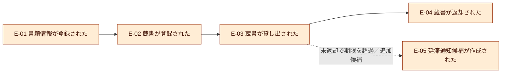
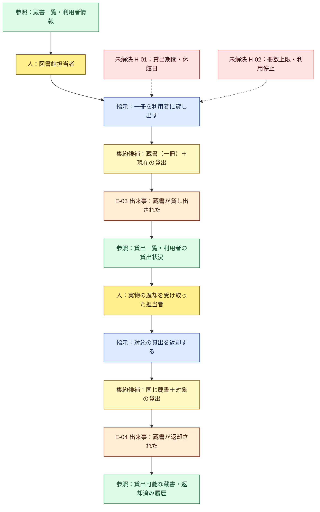
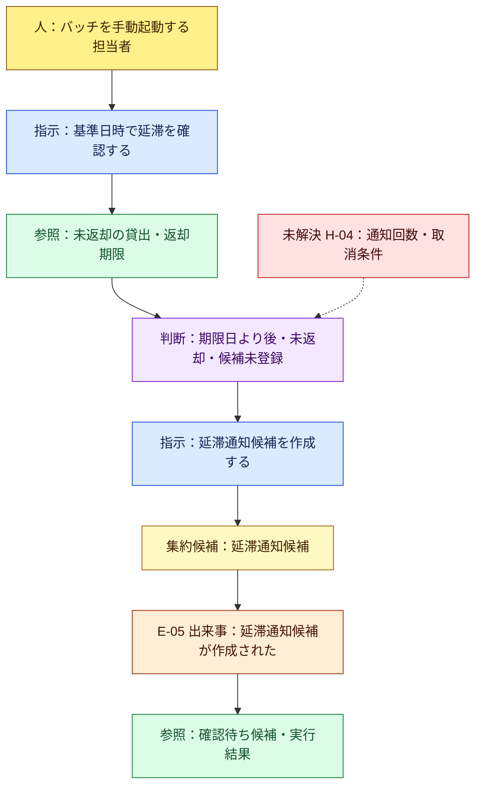

# 図書館システムのイベントストーミング

作成日：2026-10-01

状態：AIが単独で整理した学習用のモデル案。実装・業務担当者との合意は未実施。

## 1. 今回行ったこと

図書館の出来事を洗い出し、時間の流れに並べ、操作する人・指示・判断条件・参照画面を補った。その結果から、守るルールとモデルの境界を[ドメインモデル](domain-model.md)へ整理した。

手順は参考記事の[イベントストーミング](https://zenn.dev/yamachan0625/books/ddd-hands-on/viewer/chapter5_event_storming)を参考にした。出来事、操作、判断条件を別々に扱う。今回の図・業務ルール・事例は、この学習プロジェクト向けに作成した案。

実施者はAI一名。利用者、図書館担当者、開発者の視点から検討したが、実際に各担当者へヒアリングした記録ではない。疑問は「ホットスポット」として残す。

## 2. 決定事項と、モデルを作るための仮定

ユーザーが決めた題材は、**実物の本がある図書館の蔵書・貸出管理**。技術の学習方針は[PROJECT_CONTEXT.md](../PROJECT_CONTEXT.md)に従う。

以下は図を具体化するための仮案。採用済みの業務要件ではない。

| ID | 今回置いた仮定 | 見直す箇所 |
|---|---|---|
| A-01 | 一つの図書館を対象とし、同じ本の複数冊を個別管理する | 複数館、配送は追加範囲 |
| A-02 | 担当者が実物の受け渡しを確認して貸出・返却を登録する | セルフ貸出機器は追加範囲 |
| A-03 | 貸出日から14日後を返却期限の日付とする。期限当日の返却は延滞にしない | 実際の期間・休館日の扱いは未確定 |
| A-04 | 業務上の日付は日本時間で判定する。操作の時刻は別に記録する | 日付と時刻の保存方式は実装時に決める |
| A-05 | 最初は利用可能なテスト利用者を用意し、冊数上限・貸出延長は扱わない | 会員停止、上限、延滞者の貸出制限は未確定 |
| A-06 | バッチは同じ貸出への初回の延滞通知候補を一度だけ記録する | 再通知・実際の送信は追加範囲 |

例：10月1日に貸し出した本の期限は10月15日。未返却なら10月16日から延滞と判定する。これはA-03／A-04を使った例で、実在する図書館の規則の説明ではない。

## 3. 出来事の洗い出し

イベント名は、業務で起きた結果として読む。「一覧を開いた」「ボタンを押した」はこの一覧に含めない。

| ID | 出来事 | 起きる条件 | 範囲 |
|---|---|---|---|
| E-01 | 書籍情報が登録された | 担当者がタイトル・著者などを登録した | 初期データから開始可能 |
| E-02 | 蔵書が登録された | 実物の一冊に蔵書番号を付けて登録した | 初期データから開始可能 |
| E-03 | 蔵書が貸し出された | 貸出可能な一冊と利用者を指定し、貸出登録が成立した | 最初の業務フロー |
| E-04 | 蔵書が返却された | 担当者が実物を受け取り、対象の貸出を終了した | 最初の業務フロー |
| E-05 | 延滞通知候補が作成された | バッチが未返却・期限超過を確認し、未登録の候補を記録した | バッチの候補 |
| E-06 | 予約が受け付けられた | 利用者が書籍を予約し、受付条件を満たした | 追加候補 |
| E-07 | 予約用に蔵書が取り置かれた | 返却等で利用可能になった一冊が予約へ割り当てられた | 追加候補 |
| E-08 | 予約が取り消された | 利用者の取消など、採用した条件が成立した | 追加候補 |
| E-09 | 購入希望が申請された | 利用者が未所蔵の本などの購入希望を提出した | 追加候補 |
| E-10 | 購入希望が承認された | 権限を持つ担当者が内容を確認して承認した | 追加候補 |
| E-11 | 購入希望が見送られた | 権限を持つ担当者が理由を記録して見送りとした | 追加候補 |

「返却期限が過ぎた」は時間の経過。初期案では、貸出の状態を更新するイベントを別途保存せず、未返却かつ基準日が期限日より後かどうかを判定する。「貸出が拒否された」「登録が失敗した」は、成功イベントとは別の操作結果として扱う。

## 4. 時系列に並べる

代表的な筋書きを三つに分けた。矢印は出来事の前後関係を示し、この段階では自動処理の接続を意味しない。

- 正常系：書籍・各冊を登録する → 貸し出す → 期限内に返却する。
- 延滞：貸し出す → 期限を過ぎても未返却 → バッチが通知候補を記録する → 後日返却する。
- 承認の追加案：購入希望を申請する → 担当者が承認・見送りを決める。承認と実物の入荷・蔵書登録は別の出来事。

## 5. 出来事の間を埋める

図では、橙＝出来事、青＝指示、黄＝人、緑＝参照情報、紫＝後続処理の判断、薄黄＝ルールを守るモデル候補、赤＝未解決事項。色に加えて各要素の種類もラベルに記載する。

### 5.1 貸出・返却

貸出登録に必要なのは、担当者の操作権限、利用者の有効性、一冊の貸出可否、返却期限。返却登録には、対象の貸出IDとその一冊との対応が必要。同じタイトルの別の一冊を誤って返却しない。

### 5.2 延滞確認バッチの候補

通知候補を作る前に、まだ未返却か再確認する。作成後に返却された候補は確認待ち一覧の対象から外し、作成記録は保持する案。実際のメール送信、定期起動、自動返却は今回の処理に含めない。

### 5.3 購入希望の申請・承認の追加候補

| 参照情報 | 人 | 指示 | モデル候補 | 成功した出来事 |
|---|---|---|---|---|
| 蔵書検索結果・入力した希望内容 | 利用者 | 購入希望を申請する | 購入希望 | E-09 購入希望が申請された |
| 未処理の購入希望一覧 | 承認権限を持つ担当者 | 購入希望を承認する | 購入希望 | E-10 購入希望が承認された |
| 未処理の購入希望一覧 | 承認権限を持つ担当者 | 理由を付けて見送る | 購入希望 | E-11 購入希望が見送られた |

承認しても蔵書数は増えない。実物が入荷し登録された時点でE-02が起きる。自己承認、重複申請、承認後の取消・変更はH-06として保留する。

## 6. 一巡して見つかったこと

| 発見 | モデル・画面へ反映すること |
|---|---|
| 「本」という言葉だけでは、タイトルと実物の一冊が混ざる | BookとBookCopyを分け、ISBNを蔵書番号の代わりに使わない |
| 一冊は繰り返し貸し出される | BookCopyIdとLoanIdを分け、各回の借り手・期限・返却を残す |
| 期限超過と返却は別の事実 | 延滞は日時から判定し、実物を受け取る操作で貸出を終了する |
| 二重貸出は画面のボタン無効化だけでは防げない | 一冊の貸出条件をモデルとDBの競合制御で守る |
| 返却ボタンを二度押す可能性がある | 同じLoanIdへの再操作は結果を保ち、新しい貸出を終了しない |
| 一覧の一行は一種類ではない | 蔵書一覧は一冊、貸出一覧は一回の貸出。表示用データと集約を分ける |
| 承認を学ぶ流れと貸出の流れは分けられる | 購入希望を追加候補にして、通常の貸出へ承認を付けない |

## 7. ホットスポット

作業を止めず、仮定を明記して先へ進めた。実装Issueで関係する項目を決める。

| ID | 未解決事項 | 今回の扱い | 決める時期 |
|---|---|---|---|
| H-01 | 貸出期間、期限当日、休館日、延長 | A-03／A-04。休館日と延長は未対応の案 | 貸出・延滞の実装前 |
| H-02 | 冊数上限、会員停止、延滞者の貸出制限 | A-05。上限を導入すると利用者単位の同時貸出も制御が必要 | 利用者の貸出条件を追加する前 |
| H-03 | 本の紛失・破損・除籍、貸出中の書籍情報変更 | 最初は通常の貸出・返却のみ | 蔵書編集の実装前 |
| H-04 | 延滞通知の回数、返却との競合、取消 | A-06。候補作成のみ、返却済みは確認待ち一覧から除外 | バッチの実装前 |
| H-05 | 予約の単位、順番、取り置き期間、取消 | 書籍単位の予約を候補とし、未採用 | 予約の実装前 |
| H-06 | 購入希望の承認権限、自己承認、重複申請、承認後の変更 | 状態と責任だけをモデル候補に置く | 購入希望の実装前 |
| H-07 | 実物を渡したが登録に失敗した場合の運用 | 画面は失敗を表示し、DBはロールバック。実物との照合は運用上の課題 | 貸出・返却の受入確認前 |

## 8. 次に進めるモデル案

最初は蔵書・貸出を一つの業務境界として扱う。書籍、蔵書（一冊）、その現在の貸出を中心にする。認証は既存方式を選ぶ別の関心事とし、購入希望は追加するときに別の業務境界を検討する。

集約の候補、用語、状態、確認ケースは[domain-model.md](domain-model.md)にまとめた。イベントの洗い出しは設計用であり、この図からメッセージ基盤やイベントソーシングの導入を決定したわけではない。

## 参考

- [Zenn：ドメインモデリング](https://zenn.dev/yamachan0625/books/ddd-hands-on/viewer/chapter4_domain_modeling)
- [Zenn：イベントストーミング](https://zenn.dev/yamachan0625/books/ddd-hands-on/viewer/chapter5_event_storming)
- [著者の公開原稿：ドメインモデリング](https://github.com/yamachan0625/zenn/blob/main/books/ddd-hands-on/chapter4_domain_modeling.md)
- [著者の公開原稿：イベントストーミング](https://github.com/yamachan0625/zenn/blob/main/books/ddd-hands-on/chapter5_event_storming.md)
